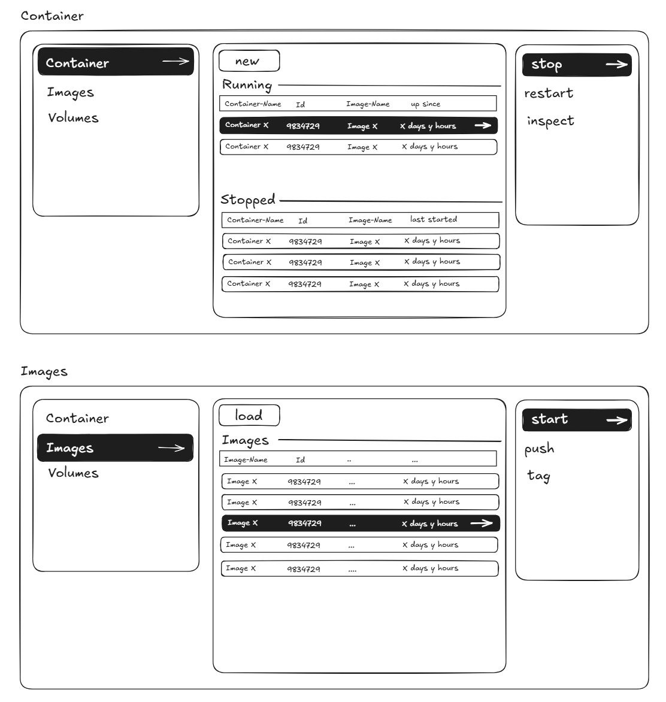

# Conman

**Conman** is a Terminal User Interface for Docker, built in [Zig](https://ziglang.org) using the [Vaxis](https://github.com/rockorager/libvaxis) UI toolkit.

---

Here's a preview of what the interface looks like (mockup):

